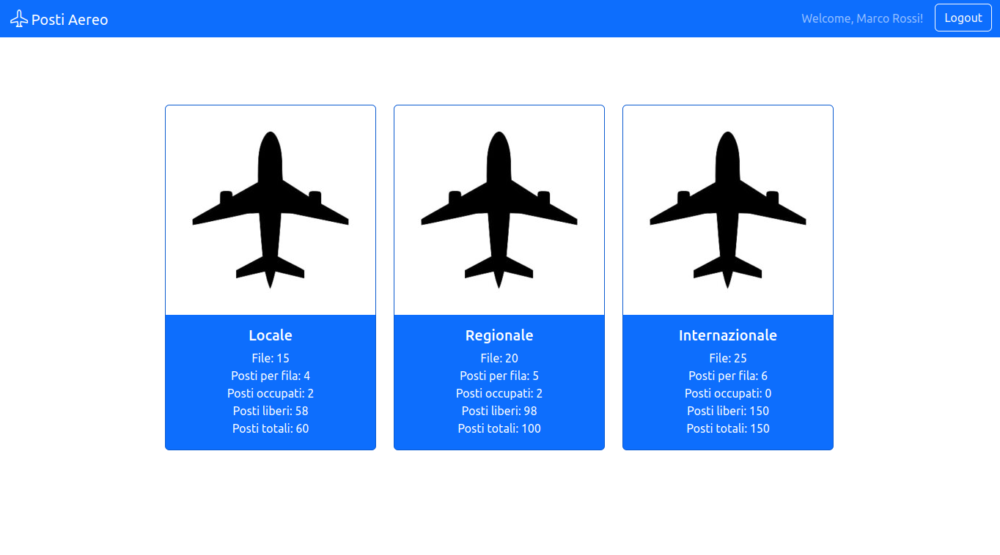
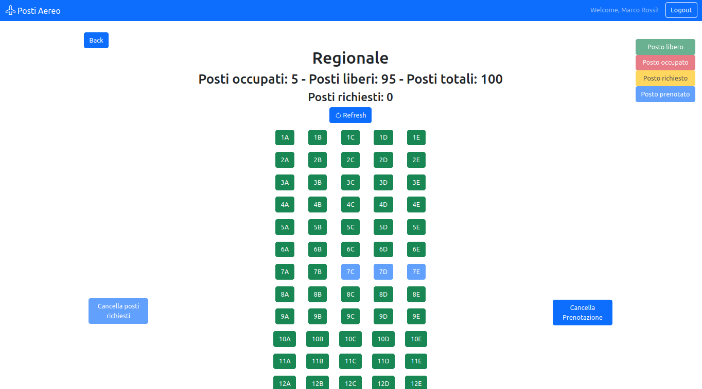

# Exam #2: "Posti Aereo"
## Student: s318922 Donnarumma Marco 

## React Client Application Routes

- Route `/`: root page, shows all airplanes information and give the user the possibility to select them
- Route `/airplanes/:airplane_id`: shows the bi-dimensional seat structure for a given airplane. If the user is logged in, this is the route where he/she can also book seats, request seats, delete seats booked
- Route `/login`: shows a form to enable the user to login
- Route `*`: used to handle non-defined routes

## API Server

### User management

#### Login

* HTTP method: `POST`  URL: `/api/sessions`
* Description: authenticate the user who is trying to login
* Request body: credentials of the user who is trying to login

``` JSON
{
    "username": "username",
    "password": "password"
}
```

* Response: `200 OK` (success)
* Response body: authenticated user

``` JSON
{
    "id": 1,
    "username": "john.doe@polito.it", 
    "name": "John"
}
```

* Error responses:  `500 Internal Server Error` (generic error), `401 Unauthorized User` (login failed)

#### Check if user is logged in

* HTTP method: `GET`  URL: `/api/sessions/current`
* Description: check if current user is logged in and get her data
* Request body: _None_
* Response: `200 OK` (success)

* Response body: authenticated user

``` JSON
{
    "id": 1,
    "username": "john.doe@polito.it", 
    "name": "John"
}
```

* Error responses: `500 Internal Server Error` (generic error), `401 Unauthorized User` (user is not logged in)

#### Logout

* HTTP method: `DELETE`  URL: `/api/sessions/current`
* Description: logout current user
* Request body: _None_
* Response: `200 OK` (success)

* Response body: _None_

* Error responses: `500 Internal Server Error` (generic error), `401 Unauthorized User` (user is not logged in)

### Airplane Management

#### Get all airplanes

* HTTP method: `GET`  URL: `/api/airplanes`
* Description: Get airplanes info and total taken seats for every airplane
* Request body: _None_
* Response: `200 OK` (success)
* Response body: Array of objects, each describing one airplane:

``` json
[
  {
        "airplane_id": 1,
        "type": "Locale",
        "totalrows": 15,
        "totalcolumns": 4,
        "totaltaken": 5
    },
    {
        "airplane_id": 2,
        "type": "Regionale",
        "totalrows": 20,
        "totalcolumns": 5,
        "totaltaken": 5
    },
    {
        "airplane_id": 3,
        "type": "Internazionale",
        "totalrows": 25,
        "totalcolumns": 6,
        "totaltaken": 0
    }
]
```

* Error responses:  `500 Internal Server Error` (generic error)

#### Get airplane by id

* HTTP method: `GET`  URL: `/api/airplanes/:id`
* Description: Get info about the airplane corresponding to the id and the booked seats in that airplane
* Request body: _None_
* Response: `200 OK` (success)
* Response body: One object describing the required airplane

``` JSON
[
  {
    "airplaneInfo": {
        "airplane_id": 1,
        "type": "Locale",
        "totalrows": 15,
        "totalcolumns": 4
    },
    "bookedSeats": [
        {
            "booking_id": 1,
            "airplane_id": 1,
            "seatcode": "3C"
        },
        {
            "booking_id": 2,
            "airplane_id": 1,
            "seatcode": "3D"
        }
    ]
  }
]
```

* Error responses:  `500 Internal Server Error` (generic error), `404 Not Found` (not present or unavailable), `422 Unprocessable Content` (validation error)

#### Get user seats by airplane id (Auth required)

* HTTP method: `GET`  URL: `/api/bookings/:airplane_id`
* Description: Get user seats for a given airplane
* Request body: _None_
* Response: `200 OK` (success)
* Response body: One array of objects describing user seats

``` JSON
[
    {
        "booking_id": 1,
        "airplane_id": 1,
        "user": 1,
        "seatcode": "3C"
    },
    {
        "booking_id": 2,
        "airplane_id": 1,
        "user": 1,
        "seatcode": "3D"
    }
]
```

* Error responses:  `500 Internal Server Error` (generic error), `404 Not Found` (not present or unavailable), `422 Unprocessable Content` (validation error)

#### Add a new booking (Auth required)

* HTTP method: `POST`  URL: `/api/bookings`
* Description: Adds new booking for a given airplane for a given user
* Request body: Array of seats to book, airplane id
* Response: `200 OK` (success), `409 Conflict` (Resource conflict)
* Response body: An object having 2 properties, bookingSuccess (true, false) and
seatsAlreadyTaken, which is an array filled with seats that are already taken when the user is trying to add a new booking

``` JSON
[
{
    "bookingSuccess": true,
    "seatsAlreadyTaken": []
}
]
```

* Error responses:  `500 Internal Server Error` (generic error), `404 Not Found` (not present or unavailable), `422 Unprocessable Content` (validation error)

#### Delete an existing booking (Auth required)

* HTTP method: `DELETE`  URL: `/api/bookings/:airplane_id`
* Description: Delete an existing booking for a given user for a given airplane
* Request body: _None_

* Response: `200 OK` (success)
* Response body: an empty object

* Error responses:  `503 Service Unavailable` (database error)


## Database Tables

- Table `users` - contains ("id", "email", "name", "hash", "salt")
- Table `airplanes` - contains ("airplane_id", "type", "totalrows", "totalcolumns") -> contains info about the airplanes
- Table `bookings` - contains ("booking_id", "airplane_id", "user", "seatcode") -> cointains the booked seats

## Main React Components

- `AirplaneCard` (in `AirplaneCard.jsx`): shows airplanes information in CardView
- `LoginForm` (in `Auth.jsx`): form to enable the user to log in
- `Navigation` (in `Navigation.jsx`): Navigation Bar of the application, shows application name, login/logout button
- `SeatTable` (in `SeatTable.jsx`): shows the bi-dimensional seat structure for a given airplane

## Screenshot




## Users Credentials

|         email         |   name   | plain-text password |
|-----------------------|----------|---------------------|
| yesbooking1@gmail.com   | Marco Rossi     | password            |
| yesbooking2@gmail.com | Gino Bianchi    | password            |
| nobooking1@gmail.com | Luca Neri | password            |
| nobooking2@gmail.com  | Valerio Altobelli | password            |

